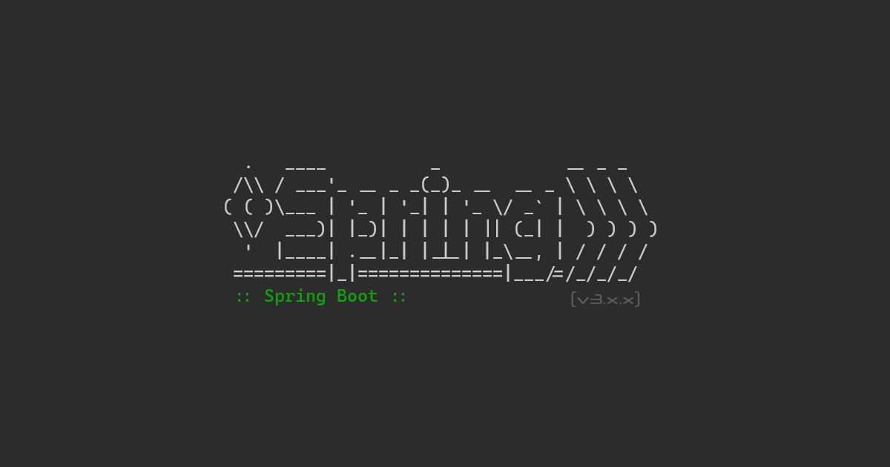

<h1 align="center">Hi 👋, I'm Seyed Ali</h1>
<h3 align="center">A humble learner constantly learning new things!</h3>

💻 **Backend Engineer | Golang Developer | Java & Rust Enthusiast**

---

### 🧠 About Me

- 💼 Currently working as a **Golang Developer**, building scalable backend systems.
- ☕️ Started out with **Java (Spring Boot)** — 3+ years of experience in Spring-based microservices.
- 🌊 Recently explored **Reactive Programming with Spring WebFlux** — loved the async model!
- 🦀 Currently learning **Rust**, diving into **Actix** and systems-level programming.
- ⚙️ Passionate about **microservices**, **clean architecture**, and **performance optimization**.
- 🧩 Believe in simplicity, concurrency, and reliability in backend design.
- ⏰ Early riser — I code on personal projects from **4 AM → 7 AM** every day.
- 🧘‍♂️ I see coding as craftsmanship, not just work.

---

### 💬 Ask Me About

_**Java, Spring Boot, Spring Security, Spring Data JPA, Spring WebFlux, Spring Security by WebFlux, Microservices, Apache Kafka, Golang, Rust, Actix, Docker, and Testcontainers**_

<!--# 💻 Tech Stack:
       -->
<!-- 
      
  -->

 

# Skill Set :)
<!-- skill set without table format

  
  
  
  
  
  
  
  
  
  
  
  
  
  
  
  
  
  
  
  
  

-->
<!-- skill sets, in table format
## My Skill Set  
<table><tr><td valign="top" width="33%">

### Language  

  
  
<a href="https://go.dev/" target="_blank">
<a href="https://go.dev/" target="_blank">

</td><td valign="top" width="33%">

### Framework

</td><td valign="top" width="33%">

### DevOps  

  
  
  

</td><td valign="top" width="33%">

### Databases  

  
  
  
  
  

</td></tr><tr><td valign="top" width="33%">

### Others?  

  
    

</td></tr></table>  
-->
<table><tr>
<td valign="top" width="25%">

### Languages  

  
  
<a href="https://go.dev/" target="_blank">  

</td>
<td valign="top" width="25%">

### Frameworks

</td>
<td valign="top" width="25%">

### DevOps  

  
  

  

</td>
<td valign="top" width="25%">

### Databases  

  
  
  
  
  

</td>
<td valign="top" width="25%">

### Others  

</td>
</tr></table>  

 

  
# 🌐 Socials:

<!--

 

  
  
  
  
  
  

-->

  
  
  
  
  
  
  

  
# 📊 GitHub Stats:
 

  <a href="https://github.com/seyedali-dev">
  
  

---

   <!-- snake -->
<!--  -->

<!-- Blogs -->
### Blogs posts
<!-- BLOG-POST-LIST:START -->
- [Demo](https://dev.to/seyedali/demo-3n68)
- [Test](https://dev.to/seyedali/test-9gp)
<!-- BLOG-POST-LIST:END -->

### ✍️ Random Dev Quote 

<!-- Proudly created with GPRM ( https://gprm.itsvg.in ) -->
